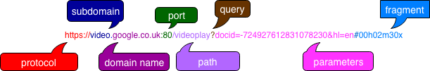

**mpc** is a parser combinator library, which allows you to build programs that understand and process particular languages (parsers).

- Many parser combinator libraries work by letting you write normal code that looks a bit like grammar without actually specifying a grammar directly
  - mpc lets you write normal code or use special notation to write a grammar directly

URL -> Uniform Resource Locator
URI -> Uniform Resource Identifier

**Note** Do not remember why I ended up in a URL rabbithole at this point, but I guess this is why I should type up my notes when I write them and not weeks later...

### URL Anatomy - Side Tangent! (literally written in my notes)

**Protocol** - how your web browser should communicate with a web server when sending/fetching a web page or document

HTTP - hypertext transfer protocol

HTTPS - hypertext transfer protocol secure -> browser encrypts any information provided by users

FTP - file transfer protocol

POP - post office protocol

SMTP - simple mail transfer protocol

IMAP - internet message access protocol

**Subdomain** - sub-division of the main domain name

**Domain name** - unique reference to a web site. Always includes a top-level domain (such as `uk` in `co.uk` addresses. `co` is for commercial and `co.uk` is considered a second-level domain

**Port** - rarely visible in URLs, but required always. If not declared, in most cases 80 is used for http and 443 for https

**Path** - refers to a file or directory on the web server. If the filename isn't specified (e.g., `doepud.co.uk/blog`), browser will look inside a /blog folder for a file called 'index' or 'default'

**Query** - common in URL of dynamic pages, question mark plus one or more parameters

**Parameters** - snippets of information found in query string of URL, separated by ampersand so they can be understood visually and be used to display content

**Fragment** - internal page reference. Sometimes called a named anchor. Usually appears at the end of a URL and begins with a hash character followed by an identifier - refers to a section within a web page

### Coding Grammars

Can create parsers that build on each other to create a language.

### Natural Grammars

`mpc` also allows you to write grammars more naturally by containing the entirety of it in a single string. Process becomes two steps - creating rules with `mpc_new` and defining them using `mpc_lang`

`mpc_lang` takes as its first argument an option flag that this interpreter will use DEFAULT but which can also be PREDICTIVE, etc. It then takes the long multi-line string that has the name of the rule on the left followed by a colon followed by its definition and ending in a semicolon.

##### Special symbols used to define rules:

| Symbol     | Meaning                                   |
| ---------- | ----------------------------------------- |
| "ab"       | The string _ab_ is required               |
| 'a'        | The character _a_ is required             |
| 'a' 'b'    | First _a_ is required, then _b_           |
| 'a' \| 'b' | Either _a_ is required or _b_ is required |
| 'a'\*      | Zero or more _a_ are required             |
| 'a'+       | One or more _a_ are required              |
| \<abba>    | The rule called _abba_ is required        |
